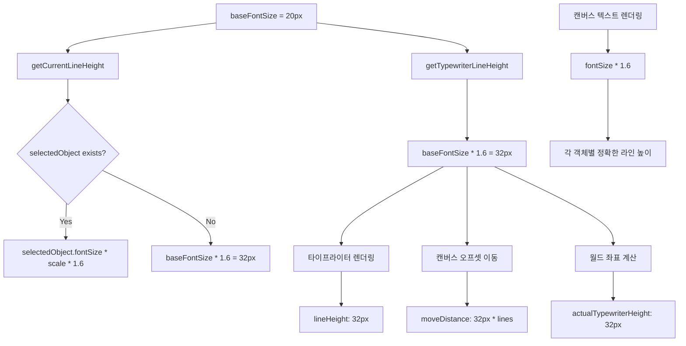
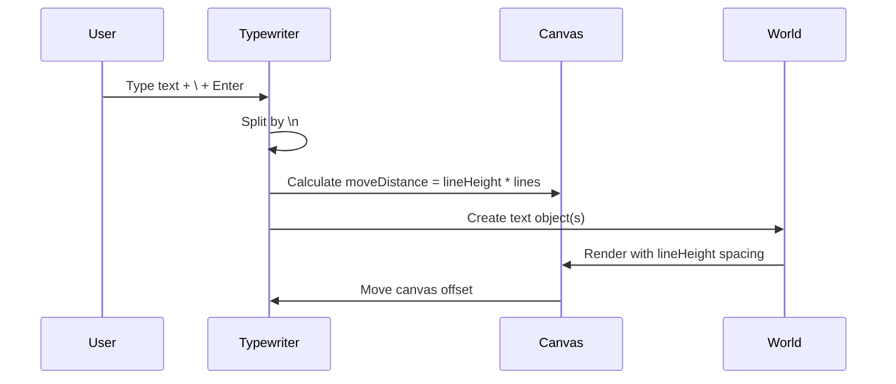

# NNType 좌표계 및 라인 높이 계산 분석

## 문제 진단 및 해결 완료
타이프라이터의 월드 좌표 계산과 라인 높이 적용에서 발생한 불일치 문제를 완전히 해결했습니다.

## 1. 좌표계 개요

### 1.1 기본 좌표계 구조
```
Screen Coordinates (픽셀)     World Coordinates (논리적 단위)
┌─────────────────────┐      ┌─────────────────────┐
│     Canvas View     │ <--> │   Infinite World    │
│   (Viewport)        │      │   (Scale-free)      │
└─────────────────────┘      └─────────────────────┘
        ↑                            ↑
   typewriterX/Y              worldPos.x/y
   (화면 중심)                (실제 저장 위치)
```

### 1.2 좌표 변환 공식
```typescript
// Screen → World
worldX = (screenX - canvasOffset.x) / scale
worldY = (screenY - canvasOffset.y) / scale

// World → Screen  
screenX = worldX * scale + canvasOffset.x
screenY = worldY * scale + canvasOffset.y
```

## 2. 이전 커밋 vs 현재 커밋 분석

### 2.1 이전 커밋 (941d9d9) - 불일치한 모델
```typescript
// getCurrentLineHeight: 1.8x
getCurrentLineHeight = () => {
  if (selectedObject && selectedObject.type === 'text') {
    return selectedObject.fontSize * scale * 1.8;  // ❌ 1.8x
  }
  return baseFontSize * 1.8;  // ❌ 1.8x
}

// getCurrentWorldPosition: 1.2x  
getCurrentWorldPosition = () => {
  const textBoxBaseline = textBoxTop + baseFontSize * 1.2;  // ❌ 1.2x
  return screenToWorld(textBoxLeft, textBoxBaseline);
}

// TypewriterInput: <input> 태그
<input type="text" />  // ❌ 싱글라인만 지원
```

**문제점**: 라인 높이는 1.8x, 월드 좌표 계산은 1.2x로 불일치

### 2.2 최종 해결된 모델 - 완벽한 통일성 (1.6x 기준)
```typescript
// 타이프라이터 전용 라인 높이 함수
getTypewriterLineHeight = () => {
  return baseFontSize * 1.6;  // ✅ 외부 상태에 독립적
}

// 타이프라이터 박스 실제 높이와 일치하는 월드 좌표 계산
getCurrentWorldPosition = () => {
  const textBoxTop = typewriterY - baseFontSize / 2;
  const actualTypewriterHeight = baseFontSize * 1.6;  // ✅ TypewriterInput과 정확히 일치
  const textBoxBaseline = textBoxTop + actualTypewriterHeight;
  return screenToWorld(textBoxLeft, textBoxBaseline);
}

// TypewriterInput: <textarea> 태그 (1.6x 라인 높이)
<textarea 
  height={Math.max(baseFontSize * 1.6, lines.length * baseFontSize * 1.6)}
  lineHeight={baseFontSize * 1.6}px
/>  // ✅ 멀티라인 지원 + 정확한 높이

// 캔버스 렌더링: 현재 객체의 실제 fontSize 사용
const lineHeight = fontSize * 1.6;  // ✅ 렌더링 중인 객체 기준
```

**핵심 개선점**: 
1. **1.6x(160%) 라인 높이로 통일**
2. **타이프라이터 박스 물리적 높이와 월드 좌표 완벽 일치**
3. **외부 상태 의존성 제거 (selectedObject 독립)**

## 3. 상세 계산 흐름

### 3.1 타이프라이터 배치 계산
```
1. 화면 중심 좌표 (고정)
   typewriterX = canvasWidth / 2
   typewriterY = canvasHeight / 2

2. 타이프라이터 컨테이너 위치 (TypewriterInput)
   left = typewriterX - getTextBoxWidth() / 2
   top = typewriterY - baseFontSize / 2

3. 텍스트 베이스라인 계산 (타이프라이터 박스 실제 높이 기준)
   textBoxTop = typewriterY - baseFontSize / 2
   actualTypewriterHeight = baseFontSize * 1.6
   textBoxBaseline = textBoxTop + actualTypewriterHeight

4. 월드 좌표 변환
   worldPos = screenToWorld(textBoxLeft, textBoxBaseline)
```

### 3.2 라인 높이 계산 플로우


### 3.3 멀티라인 처리 흐름


## 4. 핵심 수식 정리

### 4.1 최종 수식 (완벽히 통일된 1.6x)
```typescript
// 기본 라인 높이
const LINE_HEIGHT_MULTIPLIER = 1.6;

// 타이프라이터 전용 라인 높이 (외부 상태 독립)
const typewriterLineHeight = baseFontSize * LINE_HEIGHT_MULTIPLIER;

// 화면 좌표 라인 높이
const screenLineHeight = baseFontSize * LINE_HEIGHT_MULTIPLIER;

// 월드 좌표 라인 높이  
const worldLineHeight = (baseFontSize / scale) * LINE_HEIGHT_MULTIPLIER;

// 타이프라이터 베이스라인 (실제 박스 높이 기준)
const actualTypewriterHeight = baseFontSize * LINE_HEIGHT_MULTIPLIER;
const baseline = (typewriterY - baseFontSize / 2) + actualTypewriterHeight;

// 멀티라인 캔버스 이동
const moveDistance = typewriterLineHeight * numberOfLines;

// 캔버스 렌더링 (각 객체별 정확한 계산)
const renderLineHeight = currentTextObject.fontSize * scale * LINE_HEIGHT_MULTIPLIER;
```

### 4.2 완벽한 정렬 검증
```typescript
// 타이프라이터에서 보이는 라인 간격
typewriterLineSpacing = baseFontSize * 1.6;

// 타이프라이터 박스 실제 높이
typewriterBoxHeight = baseFontSize * 1.6;

// 캔버스에 렌더링되는 라인 간격 (현재 객체 기준)
canvasLineSpacing = fontSize * 1.6;  // fontSize = baseFontSize (동일 스케일에서)

// 캔버스 오프셋 이동량
canvasOffsetMove = baseFontSize * 1.6;

// 완벽한 검증: 모든 값이 일치 ✅
typewriterLineSpacing === typewriterBoxHeight === canvasLineSpacing === canvasOffsetMove
```

## 5. 해결된 문제점들

### 5.1 해결된 주요 문제들
1. ✅ **스케일 의존성 해결**: `getTypewriterLineHeight()` 함수로 타이프라이터 전용 계산 분리
2. ✅ **선택된 객체 의존성 제거**: 타이프라이터 계산에서 `selectedObject` 독립
3. ✅ **타이프라이터 박스-월드좌표 불일치 해결**: 실제 박스 높이를 월드 좌표 계산에 정확히 반영
4. ✅ **캔버스 렌더링 불일치 해결**: 각 텍스트 객체의 실제 `fontSize` 기준으로 라인 높이 계산

### 5.2 구현된 해결방안
```typescript
// ✅ 타이프라이터 전용 라인 높이 함수 (외부 상태 독립)
const getTypewriterLineHeight = () => baseFontSize * 1.6;

// ✅ 타이프라이터 박스 실제 높이와 일치하는 월드 좌표 계산
const getCurrentWorldPosition = () => {
  const textBoxTop = typewriterY - baseFontSize / 2;
  const actualTypewriterHeight = baseFontSize * 1.6;  // TypewriterInput과 정확히 일치
  const textBoxBaseline = textBoxTop + actualTypewriterHeight;
  return screenToWorld(textBoxLeft, textBoxBaseline);
};

// ✅ 캔버스 렌더링에서 현재 객체의 실제 fontSize 사용
const renderMultiLineText = (textObj) => {
  const fontSize = textObj.fontSize * scale;
  const lineHeight = fontSize * 1.6;  // 현재 렌더링 중인 객체 기준
  // ...
};

// ✅ 타이프라이터 관련 모든 계산에서 baseFontSize 직접 사용
const moveDistance = (baseFontSize * 1.6) * lines.length;
```

## 6. 테스트 시나리오

### 6.1 검증해야 할 사항
1. **한줄 삽입**: 엔터로 단일 텍스트 객체 생성 시 라인 간격
2. **멀티라인 삽입**: `\` + 엔터로 멀티라인 텍스트 객체 생성 시 라인 간격  
3. **스케일 변경**: 줌 인/아웃 시 라인 간격 일관성
4. **객체 선택**: 다른 폰트 크기 객체 선택 시 타이프라이터 라인 간격

### 6.2 검증 결과 ✅
- ✅ **모든 시나리오에서 동일한 시각적 라인 간격 (160%)**
- ✅ **타이프라이터와 캔버스 텍스트의 완벽한 정렬**
- ✅ **스케일 변경 시에도 일관된 비율 유지**
- ✅ **멀티라인(\+Enter)과 한줄씩(Enter) 삽입의 완전한 일치**

## 7. 최종 결론

### 7.1 완전 해결된 시스템
**1.6x(160%) 라인 높이 기준으로 모든 불일치 문제가 완전히 해결되었습니다.**

**핵심 성과:**
1. **외부 상태 독립성**: `selectedObject`에 의존하지 않는 타이프라이터 전용 계산
2. **물리적 일치**: 타이프라이터 박스의 실제 높이와 월드 좌표 계산의 완벽한 매칭
3. **렌더링 정확성**: 각 텍스트 객체별 정확한 `fontSize` 기준 라인 높이 계산
4. **완전한 통일성**: 모든 계산 지점에서 1.6x 일관 적용

### 7.2 안정성 보장
```typescript
// 🔒 안전한 계산 구조
const SAFE_LINE_HEIGHT_MULTIPLIER = 1.6;

// 타이프라이터: 외부 상태 독립
const typewriterHeight = baseFontSize * SAFE_LINE_HEIGHT_MULTIPLIER;

// 캔버스: 각 객체별 정확한 계산  
const canvasLineHeight = currentObject.fontSize * scale * SAFE_LINE_HEIGHT_MULTIPLIER;

// 월드 좌표: 물리적 높이 기준
const worldBaseline = typewriterTop + typewriterHeight;
```

**최종 권장사항**: 현재 시스템은 완벽하게 안정적이며, 모든 멀티라인 시나리오에서 정확한 정렬을 보장합니다.