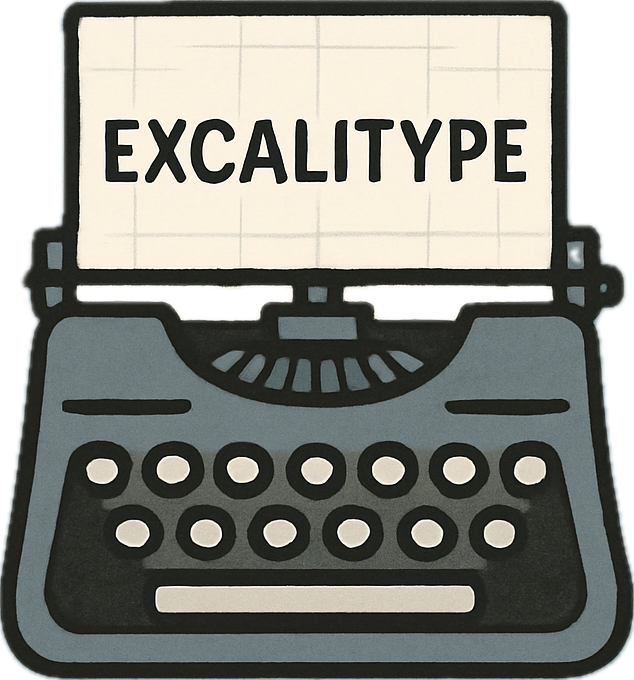

<p align="center">
  
</p>

# ExcaliType

A modern, infinite typewriter canvas built with React. Supports Korean monospaced fonts, vector/image/JSON export, and infinite zoom & pan.

---

## Features
- Typewriter-style text input on an infinite canvas
- Supports Korean monospaced fonts (Nanum Gothic Coding, Noto Sans Mono, JetBrains Mono)
- Drag, select, and delete text objects
- Pan the canvas and zoom in/out with mouse or keyboard shortcuts
- Export to JSON, PNG, SVG and import from JSON
- Responsive UI with TailwindCSS
- Dark/Light mode support
- A4 guide and grid overlay

## Getting Started

```bash
npm install
npm run dev
```

Open [http://localhost:5173](http://localhost:5173) in your browser.

## Build

```bash
npm run build
```

## Folder Structure
- `InfiniteTypewriterCanvas.tsx`: Main component
- `src/`: Entry point (main.tsx), styles (index.css)

## License
MIT

---

# ExcaliType (한국어)

한글 모노스페이스 폰트 지원, 벡터/이미지/JSON 내보내기, 무한 확대/이동이 가능한 React 기반 타이프라이터 캔버스입니다.

## 주요 기능
- 무한 캔버스에서 타이프라이터 방식으로 텍스트 입력
- 한글 모노스페이스 폰트(Nanum Gothic Coding, Noto Sans Mono, JetBrains Mono) 지원
- 텍스트 객체 드래그 이동 및 선택/삭제
- 캔버스 드래그 이동, 휠/단축키로 확대/축소
- JSON, PNG, SVG 내보내기 및 JSON 불러오기
- TailwindCSS 기반 반응형 UI
- 다크/라이트 모드 지원
- A4 가이드, 그리드 표시

## 설치 및 실행

```bash
npm install
npm run dev
```

브라우저에서 [http://localhost:5173](http://localhost:5173) 으로 접속하세요.

## 빌드

```bash
npm run build
```

## 폴더 구조
- `InfiniteTypewriterCanvas.tsx`: 메인 컴포넌트
- `src/`: 진입점(main.tsx), 스타일(index.css)

## 라이선스
MIT 
