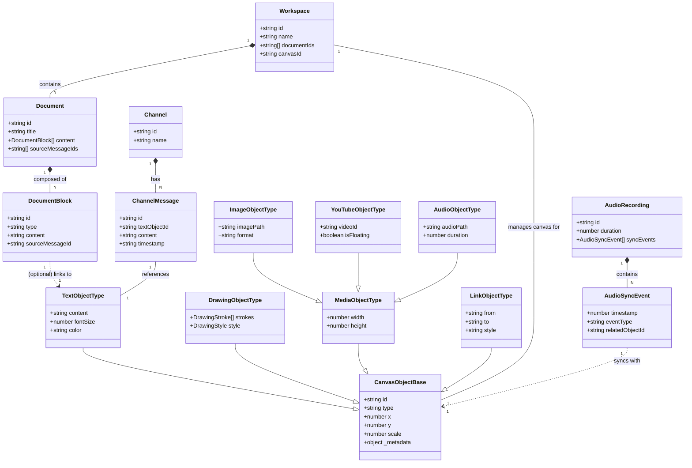
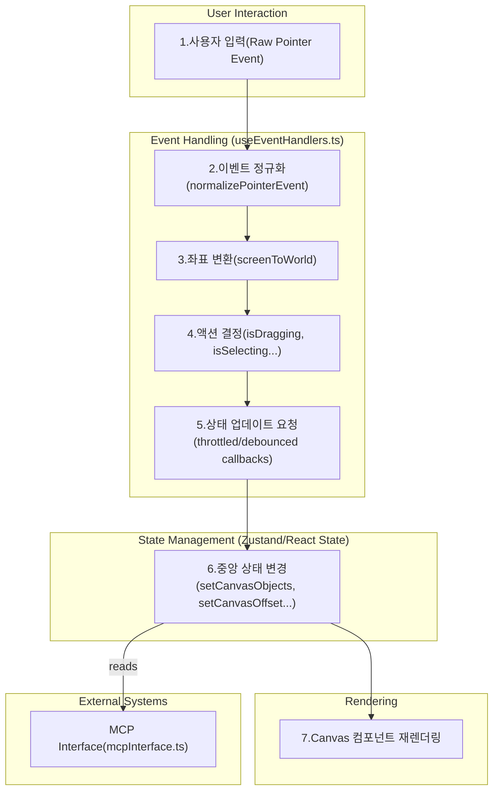

# 데이터 모델 및 흐름 (Data Model & Flow)

## 1. 소개

이 문서는 nntype 프로젝트의 핵심 데이터 구조와 사용자 인터랙션에 따른 데이터 처리 흐름을 정의합니다. 현재 구현된 시스템과 `A-claude.md`에서 제안된 확장 계획을 통합하여 미래의 아키텍처를 조망합니다.

* **데이터 모델:** 시스템이 다루는 모든 정보의 구조와 관계를 정의합니다. (ERD 또는 클래스 다이어그램 형태)
* **데이터 흐름:** 사용자 입력이 어떤 과정을 거쳐 애플리케이션 상태를 변경하고 화면에 반영되는지를 보여줍니다.

---

## 2. 통합 데이터 모델 (Integrated Data Model)

아래 다이어그램은 현재의 `CanvasObjectType`과 제안된 `Workspace`, `Document`, `Channel` 및 다양한 미디어 객체를 통합한 전체 시스템의 데이터 구조를 보여줍니다.

* **`CanvasObjectBase`**: 모든 캔버스 객체가 상속받는 기본 속성(ID, 위치, 크기 등)을 정의합니다.
* **관계**:
  * `Workspace`는 여러 개의 `Document`와 `Canvas`를 가질 수 있습니다.
  * `Document`는 여러 `DocumentBlock`으로 구성되며, 이는 캔버스의 `TextObjectType`과 연결될 수 있습니다.
  * `Channel`은 여러 `ChannelMessage`를 통해 `TextObjectType`을 그룹화합니다.
  * `AudioRecording`은 `AudioSyncEvent`를 통해 캔버스 객체의 변화를 시간 순서대로 기록합니다.

---

## 3. 데이터 흐름 다이어그램 (Data Flow Diagram)

사용자 입력부터 캔버스 렌더링까지의 데이터 흐름은 아래와 같습니다. 이 흐름은 `useEventHandlers.ts` 훅을 중심으로 처리됩니다.

* **사용자 입력 (User Input):** 사용자가 마우스 클릭, 이동, 키보드 입력 등의 이벤트를 발생시킵니다.
* **이벤트 정규화 (Normalize Event):** 브라우저의 원시(raw) 이벤트를 일관된 `NormalizedPointerEvent` 형식으로 변환합니다.
* **좌표 변환 (Coordinate Transform):** 화면 좌표(Screen Space)를 캔버스의 논리적 좌표(World Space)로 변환합니다.
* **액션 결정 (Determine Action):** 이벤트의 종류, 현재 모드, 키보드 상태(e.g., `isSpacePressed`) 등을 조합하여 사용자의 의도(객체 드래그, 캔버스 패닝, 영역 선택 등)를 파악합니다.
* **상태 업데이트 (Update State):** 결정된 액션에 따라 `setCanvasObjects`, `setSelectedObject` 등의 콜백 함수를 호출하여 중앙 상태(Zustand 또는 React State)를 변경합니다. 이 과정에서 성능 최적화를 위해 `throttle`이나 `debounce`가 사용됩니다.
* **캔버스 재렌더링 (Re-render Canvas):** 상태 변경을 감지한 React가 렌더링 관련 컴포넌트(e.g., `CanvasContainer`)를 다시 실행하여 변경된 내용을 `Canvas`에 그립니다.
* **외부 인터페이스 (MCP Interface):** `mcpInterface.ts`와 같은 외부 시스템은 현재 상태(Context)를 읽어 분석하거나, 특정 액션을 실행하여 데이터 흐름에 개입할 수 있습니다.

