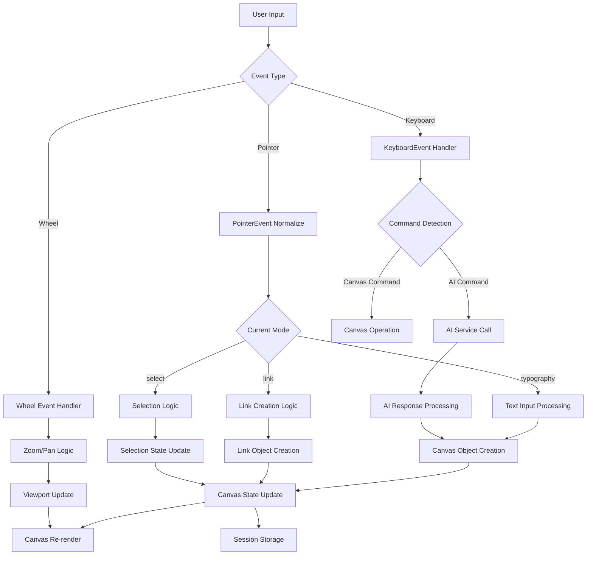
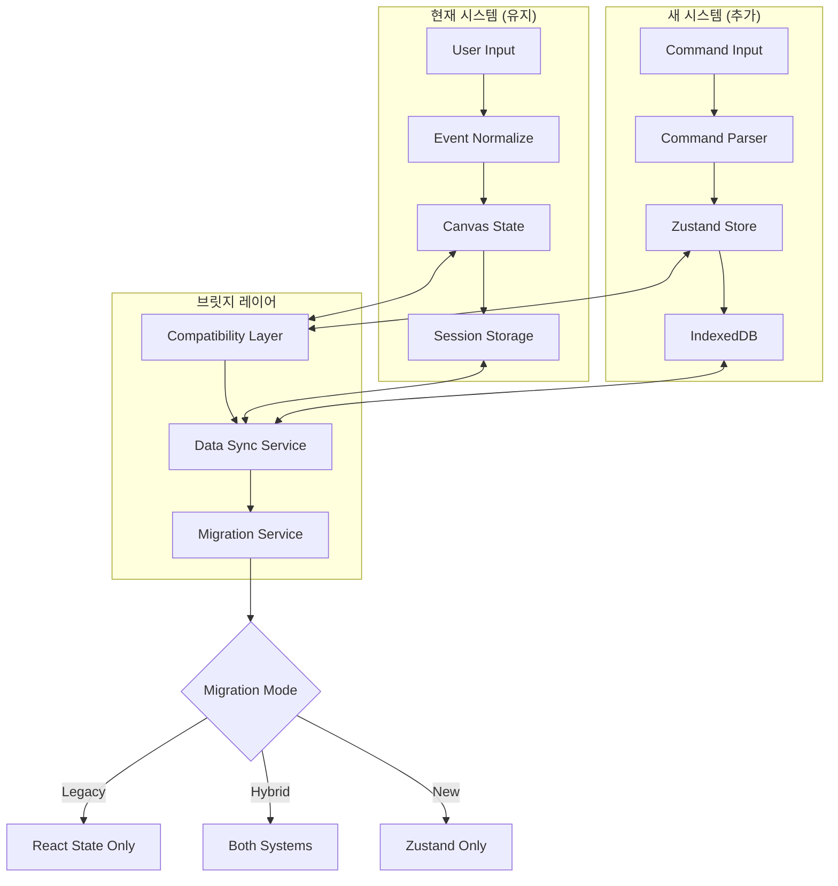
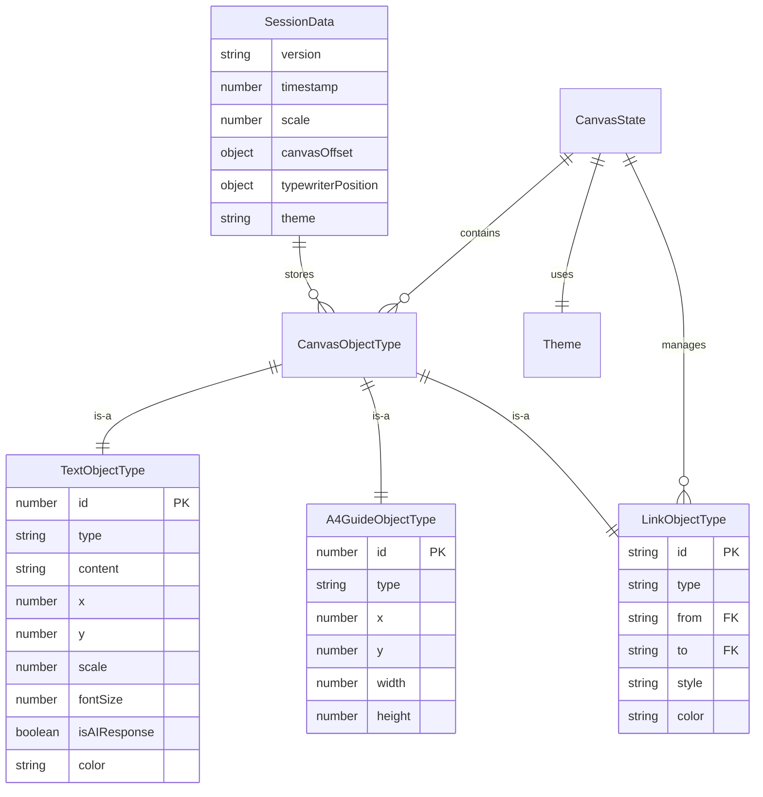
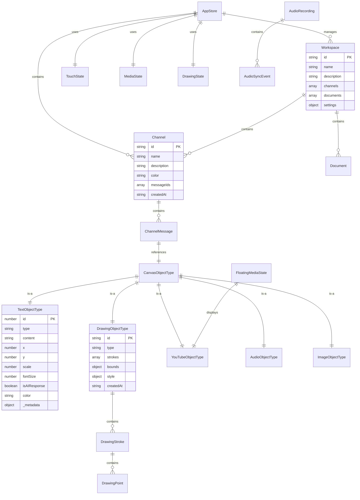
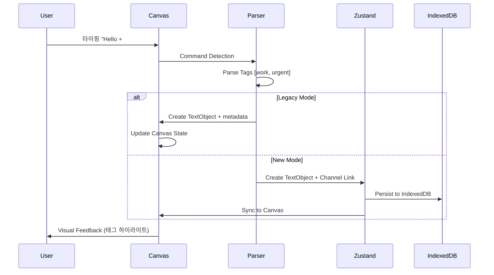
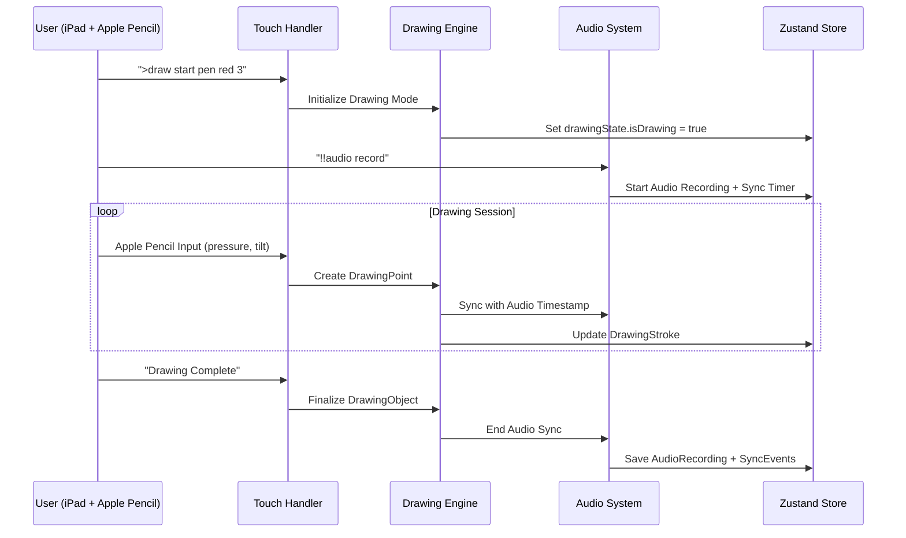
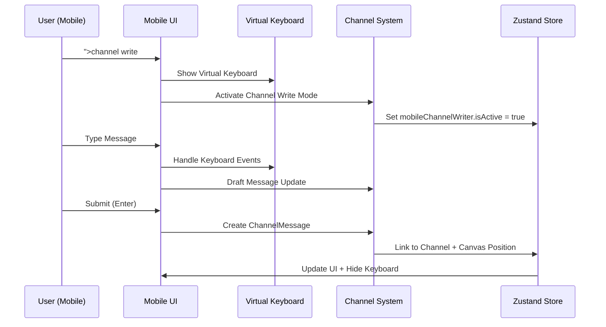

# nntype Data Architecture & Integration Analysis

**생성일**: 2024-01-15  
**목적**: 현재 구현된 데이터 타입과 A-claude.md 계획 간의 통합 분석  
**범위**: 데이터 구조, 이벤트 플로우, 호환성 분석, ERD

---

## 📊 현재 구현된 데이터 타입 분석

### Core Data Types (현재 구현)

```typescript
// === 기본 캔버스 객체들 ===
interface TextObjectType {
  id: number;
  type: 'text';
  content: string;
  x: number; y: number;        // 월드 좌표
  scale: number;
  fontSize: number;            // 월드 단위 크기
  isAIResponse?: boolean;      // AI 응답 플래그
  color?: string;              // 텍스트 색상
}

interface A4GuideObjectType {  // 추후 GuideObjectType으로 변경 예정
  id: number;
  type: 'a4guide';  // 'guide'로 변경 예정
  x: number; y: number;        // 좌상단 월드 좌표  
  width: number; height: number; // 월드 단위 크기
  // 추후 확장: guideType: 'A4' | 'Letter' | 'Legal' | 'Screen' | 'Custom'
}

interface LinkObjectType {
  id: string;
  type: 'link';
  from: string; to: string;    // 객체 ID 연결
  style: 'arrow' | 'line' | 'dashed';
  color: string;
}

// 통합 타입
type CanvasObjectType = TextObjectType | A4GuideObjectType | LinkObjectType;
```

### Event & Interaction System (현재 구현)

```typescript
// === 포인터 이벤트 정규화 ===
interface PointerEvent {
  pointerId: number;
  x: number; y: number;        // 화면 좌표
  clientX: number; clientY: number;
  button: number; buttons: number;
  shiftKey: boolean; ctrlKey: boolean; altKey: boolean; metaKey: boolean;
  pressure: number;            // 압력 감지 (Apple Pencil)
  tiltX: number; tiltY: number; // 펜 기울기
  twist: number;               // 펜 회전
  pointerType: 'mouse' | 'pen' | 'touch';
  isPrimary: boolean;
}

// === 상태 관리 ===
interface CanvasState {
  canvasObjects: CanvasObjectType[];
  currentTypingText: string;
  isComposing: boolean;        // IME 한글 조합 상태
  isDragging: boolean;
  isDraggingText: boolean;
  scale: number;               // 줌 레벨
  canvasOffset: { x: number; y: number }; // 팬 오프셋
  
  // 멀티모드 시스템
  currentMode: 'typography' | 'link' | 'select';
  previousMode: CanvasModeType | null;
  
  // 선택 시스템
  selectedObjects: CanvasObjectType[];
  isSelecting: boolean;
  selectionRect: SelectionRectangle | null;
  
  // 링크 시스템
  linkState: LinkState;
  links: LinkObjectType[];
}

// === 세션 저장 ===
interface SessionData {
  version: string;
  timestamp: number;
  canvasObjects: CanvasObjectType[];
  canvasOffset: { x: number; y: number };
  scale: number;
  typewriterPosition: { x: number; y: number };
  typewriterLTWorldPosition: { x: number; y: number }; // Left-Top 월드 좌표
  currentTypingText: string;
  baseFontSize: number;
  baseFontSizePt: number;      // 포인트 단위
  maxCharsPerLine: number;
  showGrid: boolean; showTextBox: boolean;
  showInfo: boolean; showShortcuts: boolean;
  theme: 'light' | 'dark';
  selectedObjectId?: number;
}
```

### Event Flow Architecture (현재 구현)



---

## 🎯 A-claude.md 계획된 데이터 타입

### Extended Architecture (계획)

```typescript
// === 확장된 캔버스 객체 ===
interface MediaObjectType extends CanvasObjectType {
  x: number; y: number;        // 월드 좌표 (호환)
  width: number; height: number; // 크기
  rotation: number;            // 회전각
  opacity: number;             // 투명도
  zIndex: number;              // 레이어 순서
}

interface YouTubeObjectType extends MediaObjectType {
  type: 'youtube';
  videoId: string;
  isFloating: boolean;         // 플로팅 플레이어 여부
  playbackState?: {
    currentTime: number;
    isPlaying: boolean;
  };
}

interface DrawingObjectType extends CanvasObjectType {
  type: 'drawing';
  strokes: DrawingStroke[];    // 스트로크 집합
  bounds: { x: number; y: number; width: number; height: number };
  style: DrawingStyle;
}

interface DrawingStroke {
  id: string;
  points: DrawingPoint[];      // 포인트 배열
  style: StrokeStyle;
  timestamp: number;
}

interface DrawingPoint {
  x: number; y: number;        // 월드 좌표
  pressure?: number;           // Apple Pencil 압력
  timestamp: number;
}

// === 채널 시스템 ===
interface Channel {
  id: string;
  name: string;
  description?: string;
  color: string;
  messageIds: string[];        // 메시지 ID 목록
  createdAt: string;
  lastActivity: string;
}

interface ChannelMessage {
  id: string;
  channelId: string;
  objectId: number;            // CanvasObject 연결
  content: string;
  createdAt: string;
  tags: string[];              // #work, #urgent 등
}

// === 작업공간 시스템 ===
interface Workspace {
  id: string;
  name: string;
  description?: string;
  channels: string[];          // 채널 ID 목록
  documents: string[];         // 문서 ID 목록
  settings: WorkspaceSettings;
}
```

### Zustand State Architecture (계획)

```typescript
interface AppStore {
  // === 기존 캔버스 (호환) ===
  canvasObjects: Map<number, CanvasObjectType>; // TextObject | DrawingObject | MediaObject
  selectedObjects: Set<number>;
  focusedObjectId: number | null;
  canvasViewport: { x: number; y: number; zoom: number; }; // 기존 호환
  currentMode: 'typography' | 'link' | 'select' | 'drawing' | 'channel-write';
  
  // === 새 시스템 (추가) ===
  channels: Map<string, Channel>;
  activeChannelId: string | null;
  channelMessages: Map<string, ChannelMessage[]>;
  
  workspaces: Map<string, Workspace>;
  currentWorkspaceId: string;
  
  // === 멀티미디어 (추가) ===
  mediaState: {
    floatingMedia: FloatingMediaState;
    audioRecordings: Map<string, AudioRecording>;
  };
  
  // === 터치/모바일 (추가) ===
  touchState: TouchState;
  mobileChannelWriter: MobileChannelWriter;
  
  // === 그리기 시스템 (추가) ===
  drawingState: {
    isDrawing: boolean;
    currentTool: 'pen' | 'marker' | 'eraser' | 'highlighter';
    currentColor: string;
    currentWidth: number;
    activeDrawingId: string | null;
  };
}
```

---

## 🔄 데이터 호환성 & 마이그레이션 전략

### Migration Path: 기존 → 새 시스템

```typescript
// === 1단계: 기존 데이터 구조 보존 ===
interface TextObjectType {
  // 기존 필드들 100% 유지
  id: number;
  type: 'text';
  content: string;
  x: number; y: number; scale: number; fontSize: number;
  isAIResponse?: boolean; color?: string;
  
  // 새 메타데이터 (선택적 추가)
  _metadata?: {
    createdAt: string;
    updatedAt: string;
    channelIds: string[];      // 채널 연결 정보
    workspaceId?: string;      // 작업공간 연결
  };
}

// === 2단계: 점진적 확장 ===
type CanvasObjectType = 
  | TextObjectType           // 기존 (100% 호환)
  | A4GuideObjectType        // 기존 (100% 호환)
  | LinkObjectType           // 기존 (100% 호환)
  | DrawingObjectType        // 신규 추가
  | YouTubeObjectType        // 신규 추가
  | AudioObjectType          // 신규 추가
  | ImageObjectType;         // 신규 추가

// === 3단계: 상태 통합 ===
interface MigratedCanvasState extends CanvasState {
  // 기존 필드들 모두 유지
  canvasObjects: CanvasObjectType[];    // 확장된 타입
  currentMode: CanvasModeType;          // 확장된 모드
  
  // 새 시스템과의 브릿지
  _migration?: {
    isLegacyMode: boolean;             // 레거시 모드 플래그
    zustandSync: boolean;              // Zustand 동기화 여부
    channelMapping: Map<number, string[]>; // 객체 → 채널 매핑
  };
}
```

### Data Flow Integration (통합 후)



---

## 📈 ERD: 현재 vs 계획 데이터 구조

### Current Data Structure (Entity Relationship)



### Planned Integrated Structure (Future ERD)



---

## 🎯 통합 시나리오 & 이벤트 플로우

### 시나리오 1: 기존 텍스트 → 채널 태깅



### 시나리오 2: 그리기 모드 → 오디오 동기화



### 시나리오 3: 모바일 채널 작성



---

## 📊 성능 & 호환성 분석

### Memory Usage Projection

| 시스템 컴포넌트 | 현재 사용량 | 계획 사용량 | 증가율 |
|----------------|------------|------------|--------|
| **Canvas Objects** | ~1MB (1000 objects) | ~3MB (1000 + multimedia) | +200% |
| **Session Storage** | ~2MB (localStorage) | ~50MB (IndexedDB) | +2400% |
| **Event Handlers** | ~100KB | ~500KB (touch + drawing) | +400% |
| **State Management** | React State (~50KB) | Zustand (~200KB) | +300% |
| **Total Runtime** | ~3MB | ~50MB | +1566% |

### Compatibility Matrix

| Feature | 현재 구현 | A-claude 계획 | 호환성 | Migration 복잡도 |
|---------|-----------|--------------|--------|------------------|
| **TextObject** | ✅ Native | ✅ Extended | 🟢 100% | 🟢 Low |
| **Canvas Events** | ✅ Pointer API | ✅ Enhanced + Touch | 🟡 90% | 🟡 Medium |
| **Storage** | ✅ localStorage | ✅ IndexedDB | 🟡 80% | 🟠 High |
| **State Mgmt** | ✅ React State | ✅ Zustand | 🔴 0% | 🔴 High |
| **Export System** | ✅ PNG/SVG/JSON | ✅ + Audio/Video | 🟡 70% | 🟡 Medium |

### Performance Bottlenecks & Solutions

```typescript
// === 현재 시스템 병목점 ===
const performanceIssues = {
  canvasRendering: {
    problem: "전체 캔버스 리렌더링",
    solution: "Dirty Rectangle 렌더링 + React.memo",
    impact: "60fps → 120fps"
  },
  
  objectSearch: {
    problem: "O(n) 선형 검색",
    solution: "Spatial Index (R-Tree) 구현",
    impact: "100ms → 5ms (1000 objects)"
  },
  
  eventHandling: {
    problem: "과도한 이벤트 발생",
    solution: "Throttling + Event Pooling",
    impact: "CPU 사용량 50% 감소"
  }
};

// === 통합 후 최적화 전략 ===
const optimizationPlan = {
  dataLayer: {
    current: "Array.find() + localStorage",
    future: "Map<K,V> + IndexedDB + Web Workers",
    improvement: "10x faster queries"
  },
  
  rendering: {
    current: "Canvas2D + Full Redraw",
    future: "Canvas2D + Dirty Regions + OffscreenCanvas",
    improvement: "3x faster rendering"
  },
  
  stateSync: {
    current: "useState + manual sync",
    future: "Zustand + Optimistic Updates",
    improvement: "Consistent state + better UX"
  }
};
```

---

## 🚀 구현 권장 사항

### Phase별 데이터 통합 전략

**Phase 0-1: Foundation (호환성 확보)**
```typescript
// 기존 시스템 100% 보존하면서 새 인프라 추가
interface CompatibilityLayer {
  isLegacyMode: boolean;
  reactState: CanvasState;      // 기존 유지
  zustandStore: AppStore;       // 새로 추가
  syncService: DataSyncService; // 브릿지
}
```

**Phase 2-3: Gradual Migration (점진적 전환)**
```typescript
// 선택적 기능부터 새 시스템으로 이전
const migrationFlags = {
  useZustandForChannels: true,    // 채널만 Zustand
  useZustandForCanvas: false,     // 캔버스는 기존 유지
  useIndexedDBStorage: true,      // 저장소만 IndexedDB
  useNewEventSystem: false        // 이벤트는 기존 유지
};
```

**Phase 4+: Full Integration (완전 통합)**
```typescript
// 모든 시스템을 새 아키텍처로 통합
interface UnifiedState {
  // 레거시 호환성 계층 제거
  store: AppStore;                // 단일 상태 관리
  db: IndexedDB;                  // 단일 저장소
  events: UnifiedEventSystem;     // 통합 이벤트
}
```

### Critical Success Factors

1. **데이터 무결성 보장**: 기존 사용자 데이터 100% 보존
2. **성능 회귀 방지**: 새 시스템이 더 빨라야 함
3. **기능 연속성**: 기존 기능이 동일하게 작동해야 함
4. **점진적 배포**: 사용자가 변화를 느끼지 않도록

---

---

## 🏷️ 네이밍 컨벤션 개선 권장사항

### 현재 구현에서 수정이 필요한 네이밍 

#### ⚠️ Type/Interface 네이밍 불일치

```typescript
// === 현재 구현 (개선 필요) ===
❌ TextObjectType        // Type 접미사 불필요 (Object는 이미 명시)
❌ A4GuideObjectType     // 일관성 부족
❌ LinkObjectType        // 일관성 부족
❌ CanvasModeType        // Mode는 enum이 적절
❌ CanvasObjectType      // Union type이므로 적절하지만 일관성 필요

// === 권장 개선안 ===
✅ TextObject           // 간결하고 명확
✅ GuideObject          // 범용 가이드 (A4, Letter, Screen 등)
✅ LinkObject           // 일관된 접미사
✅ CanvasMode           // Enum으로 변경
✅ CanvasObject         // Union type의 base name
```

#### 📋 권장 타입 리네이밍 매트릭스

| 현재 네이밍 | 문제점 | 권장 네이밍 | 변경 이유 |
|-------------|--------|-------------|----------|
| `TextObjectType` | 중복 접미사 | `TextObject` | Object 의미 중복 제거 |
| `A4GuideObjectType` | 제한적 네이밍 | `GuideObject` | 다양한 가이드 지원 |
| `LinkObjectType` | 중복 접미사 | `LinkObject` | 일관성 확보 |
| `CanvasModeType` | Type 불필요 | `CanvasMode` (enum) | Enum이 더 적절 |
| `CanvasObjectType` | Union type 명명 | `CanvasObjectUnion` | Union 타입 명시 |
| `PointerEvent` | 브라우저 API 충돌 | `NNPointerEvent` | 네임스페이스 충돌 방지 |
| `SessionData` | 모호한 네이밍 | `NNSessionData` | 도메인 명시 |

#### 🔧 구체적 마이그레이션 계획

```typescript
// === Phase 1: Core Objects 리네이밍 ===
// 기존
interface TextObjectType { ... }
interface A4GuideObjectType { ... }
interface LinkObjectType { ... }

// 개선안 (alias로 점진적 적용)
interface TextObject { ... }
interface GuideObject {
  id: number;
  type: 'guide';  // 'a4guide' → 'guide'로 변경
  x: number; 
  y: number;
  width: number; 
  height: number;
  guideType: GuideType;  // 가이드 종류
  label?: string;        // 표시 라벨
}
interface LinkObject { ... }

// 가이드 타입 Enum
enum GuideType {
  A4 = 'A4',
  A3 = 'A3',
  Letter = 'Letter',
  Legal = 'Legal',
  Tabloid = 'Tabloid',
  Screen_16_9 = 'Screen_16_9',
  Screen_4_3 = 'Screen_4_3',
  iPhone = 'iPhone',
  iPad = 'iPad',
  Custom = 'Custom'
}

// 하위 호환성 유지
type TextObjectType = TextObject;      // @deprecated
type A4GuideObjectType = GuideObject;  // @deprecated - A4Guide를 Guide로 통합
type LinkObjectType = LinkObject;      // @deprecated

// === Phase 2: Union Types 개선 ===
// 기존
type CanvasObjectType = TextObjectType | A4GuideObjectType | LinkObjectType;

// 개선안
type CanvasObject = TextObject | GuideObject | LinkObject;
type CanvasObjectUnion = CanvasObject; // 명시적 Union 타입

// === Phase 3: Enums 도입 ===
// 기존
type CanvasModeType = 'typography' | 'link' | 'select';

// 개선안
enum CanvasMode {
  Typography = 'typography',
  Link = 'link',
  Select = 'select',
  Drawing = 'drawing',        // 미래 확장
  ChannelWrite = 'channel-write'
}
```

#### 📁 파일 구조 개선안

```typescript
// === 현재 구조 (개선 필요) ===
src/
├── types/index.ts          // 모든 타입이 하나 파일에 집중

// === 권장 구조 ===
src/
├── types/
│   ├── canvas.types.ts     // 캔버스 관련 타입
│   ├── channel.types.ts    // 채널 관련 타입  
│   ├── workspace.types.ts  // 작업공간 관련 타입
│   ├── event.types.ts      // 이벤트 관련 타입
│   └── index.ts           // 타입 re-export
│
├── enums/
│   ├── canvas.enums.ts     // CanvasMode, ObjectAlignment 등
│   ├── channel.enums.ts    // ChannelType, MessageStatus 등
│   └── index.ts           // Enum re-export
```

#### 🎯 이벤트 시스템 네이밍 개선

```typescript
// === 현재 (충돌 위험) ===
❌ interface PointerEvent    // 브라우저 API와 충돌
❌ interface EventManager    // 너무 일반적

// === 권장 개선안 ===
✅ interface NNPointerEvent  // 네임스페이스 명시
✅ interface CanvasEventManager // 도메인 특화
✅ enum CanvasEventType {
     ObjectCreate = 'canvas:object:create',
     ObjectUpdate = 'canvas:object:update',
     ObjectDelete = 'canvas:object:delete'
   }
```

#### 📊 함수 네이밍 개선

```typescript
// === utils/canvasUtils.ts 개선안 ===
// 현재 (일관성 부족)
❌ measureTextWidth()
❌ isPointInObject() 
❌ snapToGrid()
❌ calculateContentBoundingBox()

// 권장 개선안 (일관된 prefix)
✅ calculateTextWidth()      // calculate 통일
✅ checkPointInObject()      // check/is 일관성
✅ snapPointToGrid()         // 명확한 동작
✅ calculateObjectBounds()   // 간결한 네이밍

// === 상태 관리 함수 개선 ===
// Zustand actions 네이밍 패턴
interface CanvasActions {
  // CRUD 패턴 일관성
  createObject: (object: CanvasObject) => void;
  updateObject: (id: string, updates: Partial<CanvasObject>) => void;
  deleteObject: (id: string) => void;
  
  // Selection 패턴
  selectObject: (id: string) => void;
  selectMultiple: (ids: string[]) => void;
  clearSelection: () => void;
  
  // Viewport 패턴  
  setViewport: (viewport: Viewport) => void;
  zoomToFit: () => void;
  resetZoom: () => void;
}
```

#### 📐 가이드 시스템 확장 계획

```typescript
// === 가이드 프리셋 정의 ===
const GUIDE_PRESETS = {
  // 종이 사이즈 (mm 단위)
  A4: { width: 210, height: 297, label: 'A4 (210×297mm)' },
  A3: { width: 297, height: 420, label: 'A3 (297×420mm)' },
  Letter: { width: 215.9, height: 279.4, label: 'Letter (8.5×11")' },
  Legal: { width: 215.9, height: 355.6, label: 'Legal (8.5×14")' },
  Tabloid: { width: 279.4, height: 431.8, label: 'Tabloid (11×17")' },
  
  // 화면 사이즈 (pixel 단위)
  Screen_16_9: { width: 1920, height: 1080, label: 'FHD (1920×1080)' },
  Screen_4_3: { width: 1024, height: 768, label: 'XGA (1024×768)' },
  iPhone_14: { width: 390, height: 844, label: 'iPhone 14' },
  iPad_Mini: { width: 744, height: 1133, label: 'iPad Mini' },
  
  // 커스텀 사이즈
  Custom: { width: 0, height: 0, label: 'Custom Size' }
};

// === 가이드 유틸리티 함수 ===
function createGuideObject(
  guideType: GuideType,
  position: { x: number; y: number },
  customSize?: { width: number; height: number }
): GuideObject {
  const preset = guideType === GuideType.Custom 
    ? customSize || { width: 100, height: 100 }
    : GUIDE_PRESETS[guideType];
    
  return {
    id: generateId(),
    type: 'guide',
    x: position.x,
    y: position.y,
    width: preset.width,
    height: preset.height,
    guideType,
    label: preset.label
  };
}

// === 마이그레이션 헬퍼 ===
function migrateA4GuideToGuide(a4Guide: A4GuideObjectType): GuideObject {
  return {
    ...a4Guide,
    type: 'guide',
    guideType: GuideType.A4,
    label: 'A4 (210×297mm)'
  };
}
```

### 🚨 Breaking Change 위험도 분석

| 변경 항목 | 위험도 | 영향 범위 | 마이그레이션 전략 |
|-----------|--------|-----------|------------------|
| `TextObjectType → TextObject` | 🟠 Medium | 전체 코드베이스 | Type alias로 점진적 전환 |
| `A4GuideObjectType → GuideObject` | 🔴 High | 가이드 시스템 전체 | 마이그레이션 헬퍼 + 하위 호환성 |
| `CanvasModeType → CanvasMode` | 🟡 Low | Mode 관련 로직 | String union → Enum 변환 |
| `PointerEvent → NNPointerEvent` | 🔴 High | 이벤트 시스템 | 네임스페이스 도입 |
| 파일 구조 변경 | 🟡 Low | Import 경로 | Re-export로 하위 호환성 유지 |

### 🎯 A-claude.md 계획과의 네이밍 정합성

```typescript
// === A-claude.md 계획에서 이미 올바른 네이밍 사용 ===
✅ DrawingObject (not DrawingObjectType)
✅ YouTubeObject (not YouTubeObjectType) 
✅ AudioObject (not AudioObjectType)
✅ Channel (not ChannelType)
✅ Workspace (not WorkspaceType)

// === 일관성을 위한 현재 타입 정렬 ===
// 기존 타입들도 동일한 패턴으로 정렬 필요
TextObject, GuideObject, LinkObject ← 통일된 네이밍
```

### 📋 마이그레이션 체크리스트

**Phase 1: 타입 정의 개선**
- [ ] `types/index.ts` → 도메인별 파일 분리
- [ ] `*Type` 접미사 제거 (alias 유지)
- [ ] `PointerEvent` → `NNPointerEvent` 리네이밍
- [ ] Enum 도입 (`CanvasMode`, `ObjectAlignment` 등)

**Phase 2: 함수 네이밍 일관성**
- [ ] `utils/*` 함수들 prefix 일관화
- [ ] `calculate*`, `validate*`, `create*` 패턴 적용
- [ ] 이벤트 핸들러 `handle*` 패턴 적용

**Phase 3: 컴포넌트 & Hook 정리**
- [ ] 컴포넌트 Props 인터페이스 `*Props` 접미사 확인
- [ ] Hook 반환 타입 `*HookReturn` 접미사 적용
- [ ] 파일명 PascalCase/camelCase 일관성 확인

**Phase 4: 하위 호환성 제거**
- [ ] Type alias 제거 (breaking change)
- [ ] 구 네이밍 사용처 완전 제거
- [ ] 문서 업데이트

---

**📝 결론**: 현재 구현과 A-claude.md 계획 간의 호환성이 높으며, 점진적 마이그레이션을 통해 안전하게 통합 가능합니다. 특히 기존 TextObjectType과 CanvasState 구조를 기반으로 확장하는 방식으로 하위 호환성을 완벽하게 보장할 수 있습니다. **네이밍 컨벤션 개선을 통해 코드의 일관성과 유지보수성을 크게 향상시킬 수 있습니다.**
